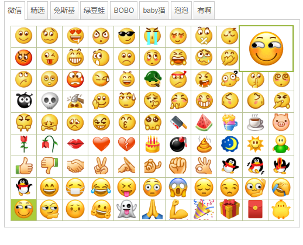

ueditor_wechat_emotion_plugin
=============================

这是一个 ueditor 的表情插件,基于原版的 emotion 修改.效果如下图

## 使用
下载本项目,直接替换 `dialogs/emotion`目录,然后找到`lang/zh-cn.js`新增一行,记得其他语言目录下也要新增对应文本
```
    'emotion':{
        'static':{
            'lang_input_wechat':'微信',   // 新增这一行
            'lang_input_choice':'精选',
            'lang_input_Tuzki':'兔斯基',
            'lang_input_BOBO':'BOBO',
            'lang_input_lvdouwa':'绿豆蛙',
            'lang_input_babyCat':'baby猫',
            'lang_input_bubble':'泡泡',
            'lang_input_youa':'有啊'
        }
    }
```
因为使用的是线上地址, wxmp 目录下的图片文件不是必要的

## TODO
补全 emotion.html 里的表情 hover 文字
